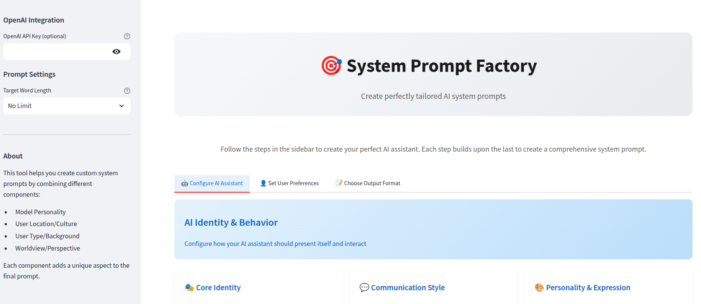

# System Prompt Factory: A Modular System Prompt Generation Utility

[](https://streamlit.io/)
[](https://www.anthropic.com/models)



## Description

| Parameter               | Description                                                                 |
| ----------------------- | --------------------------------------------------------------------------- |
| User Location           | The geographic location of the user.                                        |
| Political Views         | The political leaning of the user.                                          |
| Personality             | The personality traits of the user.                                         |
| Model Expertise         | The area of expertise of the model.                                         |
| Model Formality         | The level of formality in the model's responses.                              |
| Model Identity          | The identity or persona of the model.                                       |
| Model Language Style    | The writing style of the model.                                             |
| Model Personalities     | Specific personality traits of the model.                                   |
| Model Response Style    | The style in which the model provides responses.                              |
| User Communication Pace | The preferred pace of communication for the user.                             |
| User Learning Style     | The user's preferred method of learning.                                    |
| User Output Preference  | The user's preferred format for output (e.g., data format, executive summary). |
| User Personality        | The overall personality of the user.                                        |
| User Worldview          | The user's general perspective and beliefs about the world.                   |

## Installation

1. Clone the repository:
   ```bash
   git clone https://github.com/your-username/streamless.git
   cd streamless
   ```

2. Install the required dependencies:
   ```bash
   pip install -r requirements.txt
   ```

## Usage

1. Run the Streamlit application:
   ```bash
   streamlit run app.py
   ```

2. The application will open in your web browser. Use the interface to select building blocks from each category.

3. The combined system prompt will be displayed in the output area.

## Repository Structure

- `app.py`: The main Streamlit application file.
- `library/`: A Git submodule containing the original system prompts.
- `repo_library/`: Contains programmatic versions of the prompts that can be easily combined.
- `requirements.txt`: Lists the required Python packages.
- `README.md`: This file.


